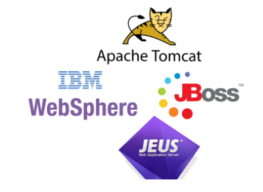

# 개발 환경 구축

| 전문가의 조언                                                                                   |
|-------------------------------------------------------------------------------------------|
| 소프트웨어 개발 시 구축해야 할 하드웨어 및 소프트웨어에는 어떤 것들이 있는지, 그리고 각 요소들의 개별적인 기능은 무엇인지 잘 파악해주세요.           |
| 데이터베이스 서버는 데이터베이스와 DBMS가 갖는 특징과 동일한 기능을 가집니다. 데이터베이스와 DBMS에 대한 자세한 내용은 SECTION 40을 참조하세요. |

## 개발환경 구축의 개요
- 개발환경 구축은 응용 소프트웨어 개발을 위해 개발 프로젝트를 이해하고, 소프트웨어 및 하드웨어 장비를 구축하는 것을 의미한다.
  - 개발 환경은 응용 소프트웨어가 운영될 환경과 유사한 구조로 구축한다.
  - 개발 프로젝트의 분석 단계의 산출물을 바탕으로 개발에 필요한 하드웨어와 소프트웨어를 선정한다.
  - 하드웨어와 소프트웨어의 성능, 편의성, 라이선스 등의 비즈니스 환경에 적합한 제품들을 최종적으로 결정하여 구축한다.

## 하드웨어 환경
- 하드웨어 환경은 사용자와의 인터페이스 역할을 하는 클라이언트 그리고, 클라이언트와 통신하여 서비스를 제공하는 서버로 구성된다.

| 클라이언트    | 서버                                 |
|----------|------------------------------------|
| PC, 스마트폰 | 웹서버, 웹 애플리케이션 서버, 데이터베이스 서버, 파일 서버 |

- 웹 서버: 클라이언트로부터 직접 요청을 받아 처리하는 서버로, 저용량의 정적 파일들을 제공한다.
    - 다음은 웹서버의 예시이다.  
    
- 웹 애플리케이션 서버(WAS) : 사용자에게 동적 서비스를 제공하기 위해 웹 서버로부터 요청을 받아 데이터 가공 작업을 수행하거나, 웹서버와 데이터베이스 서버 또는 웹 서버와 파일 서버 사이에서 인터페이스 역할을 수행하는 서버이다.
  - 
- 데이터베이스 서버(DB server) : 데이터베이스와 이를 관리하는 DBMS를 운영하는 서버이다.
  - 
- 파일 서버(File Server) : 데이터베이스에 저장하기에는 비효율적이나, 서비스 제공을 목적으로 유지하는 파일들을 저장하는 서버이다. EX) AWS s3
  -  

###  웹 서버의 기능
1. HTTP/HTTPS : 브라우저로부터 요청을 받아 응답할 때 사용되는 프로토콜
2. 통신 기록(Communication Log) : 처리한 요청들을 로그 파일로 기록하는 기능
3. 정적 파일 관리(Managing Static Files) : HTML, CSS, 이미지 등의 정적 파일들을 저장하고 관리하는 기능
4. 대역폭 제한(BandWidth Throttling) : 네트워크 트래픽의 포화를 방지하기 위해서 응답 속도를 제한하는 기능
5. 가상 호스팅(Virtual Hosting) : 하나의 서버로 여러 개의 도메인 이름을 연결하는 기능
6. 인증 (Authentication) : 사용자가 합법적인 사용자인지를 확인하는 기능

## 소프트웨어 환경
- 소프트웨어 환경은 클라이언트와 서버 운영을 위한 시스템 소프트웨어와 개발에 사용되는 개발 소프트웨어로 구성된다.
  - 시스템 소프트웨어로는 운영체제(OS), 웹 서버 및 WAS 운용을 위한 서버 프로그램, DBMS 등이 있다.
  - 개발 소프트웨어에는 요구사항 관리 도구, 설계 / 모델링 도구, 구현 도구, 빌드 도구, 테스트 도구, 형상 관리 도구 등이 있다.
    - 요구사항 관리 도구 : 요구사항의 수집과 분석, 추적 등을 편리하게 도와주는 소프트웨어
      - EX) JIRA, IBM DOORS, inteGREAT, Reqtify, Trello 등
    - 설계 / 모델링 도구 : UML(통합 모델링 언어)을 지원하며, 개발의 전 과정에서 설계 및 모델링을 도와주는 소프트웨어
      - EX) DB Designer, PlantUML, ArgoUML 등
    - 구현 도구 : 개발 언어를 통해 애플리케이션의 실제 구현을 지원하는 소프트웨어
      - EX) Eclipse, IntelliJ IDEA, Visual Studio, Netbeans, Node.js
    - 빌드 도구 : 구현 도구를 통해 작성된 소스의 빌드 및 배포, 라이브러리 관리를 지원하는 소프트웨어
      - EX) Ant, Gradle, Maven, Jenkins 등
    - 테스트 도구 : 모듈들이 요구사항에 적합하게 구현되었는지 테스트하는 소프트웨어
      - EX) CppUnit, JUnit, HttpUnit, NUit, SpringTest등
    - 형상 관리 도구: 산출물들을 버전별로 관리하여 품질 향상을 지원허는 소프트웨어
      - EX) Git
### 개발 언어의 선정 기준
1. 적정성 : 개발하려는 소프트웨어의 목적에 적합해야 한다.
2. 효율성 : 코드의 작성 및 구현이 효율적이어야 한다.
3. 이식성 : 다양한 시스템 및 환경에 적용가능해야 한다.
4. 친밀성 : 개발 언어에 대한 개발자들의 이해도와 활용도가 높아야 한다.
5. 범용성 : 다른 개발 사례가 존재하고 여러 분야에서 활용되고 있어야 한다.
    
