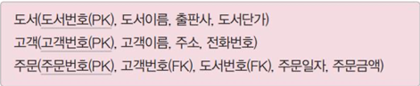

# 데이터베이스 설계

# 외울 리스트
| 외울 내용                                      |
|--------------------------------------------|
| 1. 데이터베이스 설계란?  데이터 베이스의 정의를 말해보자          |
| 2. 데이터베이스 설계 시 고려해야 할 사항이 무엇이 있나? (무일회보효확) |

## 데이터베이스 설계의 정의
- 사용자의 요구를 분석해서 -> 그것들을 컴퓨터에 저장할 수 있는 데이터베이스의 구조에 맞게 변형 후 특정 DBMS로 데이터베이스를 구현하여 일반 사용자들이 사용하게 하는 것이다.

## 데이터베이스 설계 시 고려해야 할 사항
1. 무결성 : 데이터를 조작하는 연산 수행 시 데이터가 데이터베이스가 수행하는 제약조건을 만족해야 함을 의미한다.
2. 일관성 : 데이터베이스에 저장된 데이터들 사이가 변함없이 일정해야 한다. and 특정 질의에 대한 연산 결과가 변함없이 일치 해야한다.
3. 회복 : 데이터베이스 시스템에 장애가 발생했을 때 장애 발생 직전의 상태로 복구 할 수 있어야 한다.
4. 보안 : 불법적인 데이터의 노출 또는 변경이나 손실로부터 보호 할 수 있어야 한다.
5. 효율성 : 응답시간의 단축, 시스템의 생산성, 저장 공간의 최적화 등이 가능해야 한다.
6. 데이터베이스 확장 : 데이터베이스 운영에 영향을 미치지 않으면서 지속적으로 데이터를 추가 확장 할 수 있어야 한다.

## 데이터베이스 설계 순서가 있다.

1. 요구 조건 분석 (요구 분석 명세서 작성)
2. 개념적 설계 (개념 스키마, 트랜잭션 모델링, E-R 모델링)
 -> E-R 모델링의 예시 
3. 논리적 설계 (목표 DBMS에 맞는 논리 스키마 설계, 트랜잭션 인터페이스 설계)
   -> MSSQL에 맞는 논리스키마
4. 물리적 설계 (목표 DBMS에 맞는 물리적 구조의 데이터로 변환)
   -> MSSQL에 맞는 물리스키마 설계

## 데이터베이스 요구분석은 어떤 것을 기술해야 하는가?
- 데이터베이스를 사용할 사람들로부터 필요한 용도에 대해 기술해야한다.
- 사용자가 어떤 업무를 하고 있는지?
- 데이터의 종류는 무엇인지?
- 데이터의 용도는 무엇인지?
- 데이터 처리 형태는 어떤지?
- 제약조건은 어떻게 되는지?

-> 최종적으로 요구 조건 명세서를 작성해야 한다.

## 개념적 설계 단계에는 어떤 것을 기술해야 하는가?
- 개념 스키마 모델링과 트랜잭션 모델링을 병행 수행한다.
  -> 위 그림은 계좌이체에 대해서 작성된 트랜잭션 모델링이다.
- DBMS에 독립된 E-R 다이어그램을 작성한다! (반드시 독립되게 그려!)

## 논리적 설계(데이터 모델링)에는 어떤 것을 기술해야 하는가?
- 특정 DBMS가 지원하는 논리적 자료 구조로 변환시키는 작업이다.
- 개념 스키마를 평가 및 정제하고, DBMS에 따라 서로 다른 논리적 스키마를 설계하는 단계이다.
- 트랜잭션의 인터페이스를 설계한다.
- 관계형 데이터베이스라면, 테이블을 설계하는 단계이다.

## 물리적 설계(데이터 구조화)에는 어떤 것을 기술해야 하는가?
- 논리적 설계단계에서 논리적 구조로 표현된 데이터를 디스크 등의 물리적 저장장치에 저장할 수 있는 물리적 구조의 데이터로 변환하는 과정이다.
- 다양한 데이터베이스 응용에 대해 처리 성능을 얻기 위해 데이터베이스 파일의 저장 구조 및 액세스 경로를 설정한다.

## 데이터베이스 구현 단계란?
- 논리적 설계단계와 물리적 설계 단계에서 도출된 데이터베이스 스키마를 파일로 생성하는 과정이다.
- 사용하려는 특정 DBMS와 DDL을 사용해 데이터베이스 스키마를 기술한 후 컴파일하여 빈 데이터베이스 파일을 생성한다.
- SQL문으로 트랜잭션 처리 문을 작성할 수 있나?

